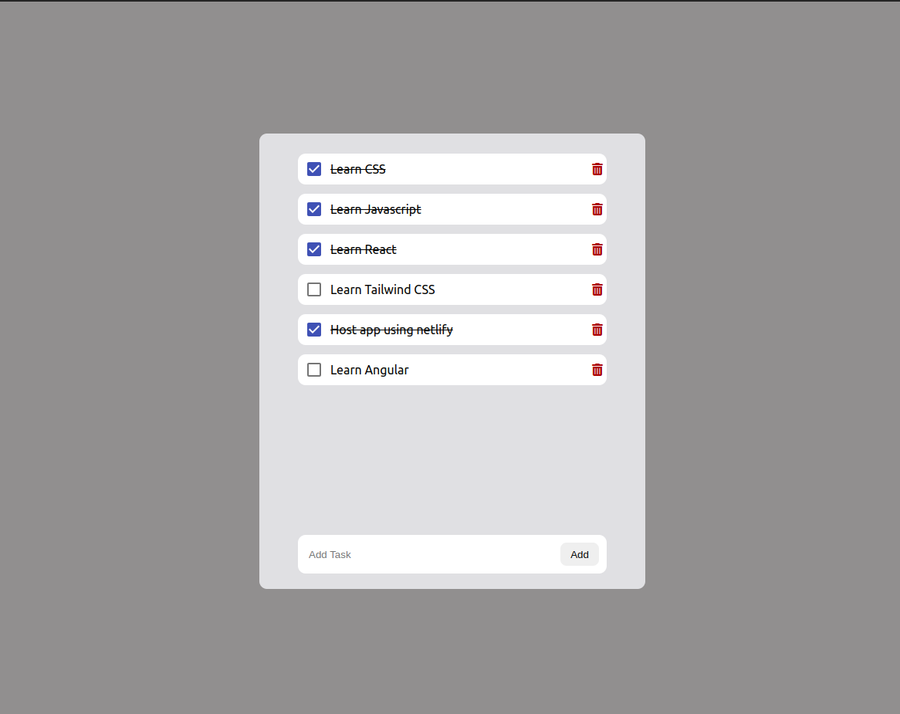

# To-Do Redux App

A simple To-Do application built with React and Redux. This app allows users to add, remove, and mark tasks as completed. The application leverages Redux for state management to ensure that tasks are consistently managed across the app. It's a great starting point for learning React, Redux, and the Redux Toolkit.

## Demo



## Steps to Install and Run the Project

1. **Clone the repository**:
   - First, clone the repository to your local machine using:
     ```bash
     git clone https://github.com/your-username/todo-redux-app.git
     ```

2. **Install dependencies**:
   - Navigate into the project folder:
     ```bash
     cd todo-redux-app
     ```
   - Install the required packages using npm:
     ```bash
     npm install
     ```

3. **Run the app**:
   - After installing the dependencies, run the app in development mode with:
     ```bash
     npm start
     ```
   - Open your browser and visit [http://localhost:3000](http://localhost:3000) to see the app in action.
   - The page will reload automatically when you make changes. You’ll also see any lint errors in the console.
